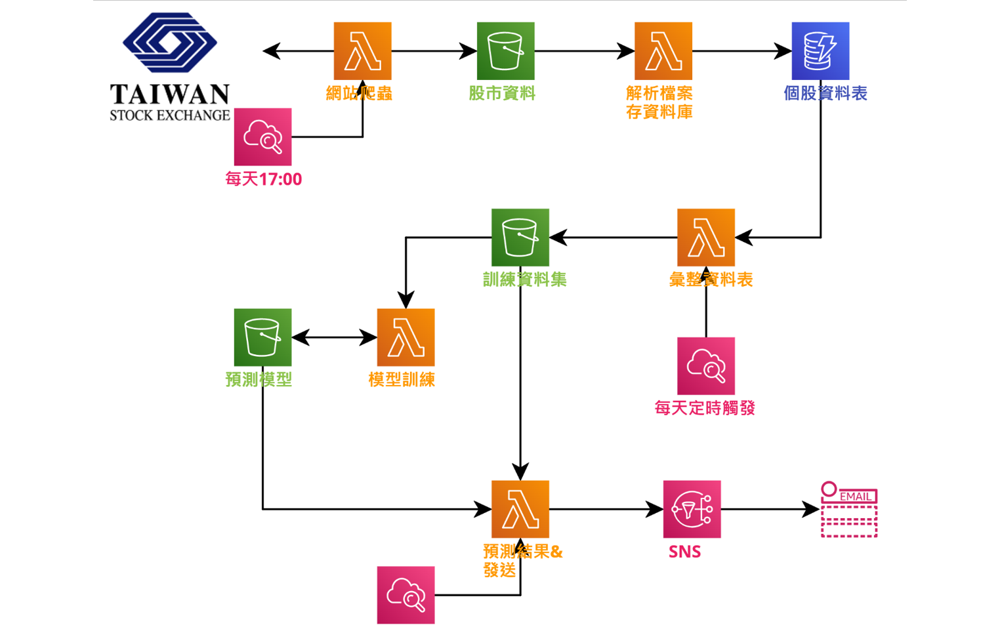

# 股市預測之雲端架構實作
### 說明
本項目利用Amazon Web Services實作，使用AWS Cloud9開發環境以及Python語言
### 前置作業
首先，Boto3這個套件提供Python程式開發人員非常詳盡的與AWS所有服務溝通的方法，必須先了解如何透過API呼叫所需服務
另外，由於佈署在AWS Lambda上的程式碼加上Layers不得超過**250MB**，而透過Docker image打包程式碼和套件的方式，能將極限一舉推升至**10GB**，解決以往容量不足只得轉往EC2的窘境，因此架構中這五個Lambda程式包都先行打包成Docker image並儲存在私有的container registry裡，建立Lambda時會直接掛載
## 整體架構

## 一、先下載台灣證券交易所的股票資料並存到Amazon Simple Storage Service(AWS S3)
第一步，一定要先有資料，從證交所爬完每檔股票資料都會以csv檔存進相應的S3桶子裡，這裡僅以兩檔股票資料作為舉例，若要新增股票代號可直接加在串列中，每爬完一檔股票資料也會稍微休息三秒鐘，以免被網站誤認為惡意IP而遭封鎖
### Step 1: import所需套件和前置作業
```py
import boto3
import pandas
import datetime
import requests
from bs4 import BeautifulSoup
import re
```
```py
# s3資源
s3 = boto3.client("s3")
# 建立Session
session = requests.Session()
# 請求原始網頁的封包
response = session.get("https://rent.591.com.tw/?region=8", headers={"user-agent":"custom"})
soup = BeautifulSoup(response.text, "html.parser")
# 以下3個重要資訊會在爬取資料時用上
csrf_token = soup.find("meta", {"name":"csrf-token"})["content"]
uje_new_session = response.cookies["591_new_session"]
phpsessid = response.cookies["PHPSESSID"]
```
### Step 2: 抓取台中市所有物件列表
```py
def get_post_list(row=0):
    '''
    取得每頁30項的租屋列表
    '''
    headers = {"X-CSRF-TOKEN": csrf_token,
               "User-Agent": "Mozilla/5.0 (Windows NT 10.0; Win64; x64) AppleWebKit/537.36 (KHTML, like Gecko) Chrome/97.0.4692.71 Safari/537.36",
               "Cookie": f"urlJumpIp=8; 591_new_session={uje_new_session}"
              }
    return session.get(f"https://rent.591.com.tw/home/search/rsList?is_format_data=1&is_new_list=1&type=1&region=8&firstRow={row}", headers=headers).json()
```
### Step 3: 抓取物件詳細資訊
```py
def get_post(post_id):
    '''
    根據物件編號取得詳細資訊
    '''
    headers = {"deviceid": phpsessid,
               "device": "pc",
               "User-Agent": "Mozila/5.0 (Windows NT 10.0; Win64; x64) AppleWebKit/537.36 (KHTML, like Gecko) Chrome/97.0.4692.71 Safari/537.36"
              } 
    return session.get(f'https://bff.591.com.tw/v1/house/rent/detail?id={post_id}', headers=headers).json()["data"]
```
### Step 4: 爬蟲主程式
```py
def house_crawler(event, context):
    # 今天日期，美國時區(AWS機器所在地)
    today = datetime.date.today()
    # 用列表收集各個物件資訊
    post_id = []
    kind = []
    types = []
    area = []
    price = []
    section = []
    rule = []
    contact = []
    role = []
    mobile = []
    fridge = []
    washer = []
    tv = []
    cold = []
    heater = []
    bed = []
    closet = []
    fourth = []
    net = []
    gas = []
    sofa = []
    table_chairs = []
    balcony = []
    lift = []
    park = []
    # 物件總數
    max_records = get_post_list()["records"]
    # 迴圈到最後一頁停止
    for row in range(0, int(max_records.replace(",","")), 30):
        post_list = get_post_list(row)["data"]["data"]
        for post in post_list:
            # 車位不是租屋資訊，而且爬取資訊的欄位並沒有出現在車位物件中，以免報錯
            if post["kind_name"] != "車位":
                post_id.append(post["post_id"])
                kind.append(post["kind_name"])
                section.append(post["section_name"])
                area.append(post["area"])
                # 有"1,000~2,000"和"1,000"這兩種可能格式，得先替換掉"~"和","才能轉為數字
                price.append(int(post["price"].split("~")[-1].replace(",","")))
                contact.append(post["contact"])
                role.append(post["role_name"])
                # 進一步取得詳細資訊
                temp = get_post(post["post_id"])
                types.append(temp["info"][3]["value"])
                # 有些聯絡電話放mobile，有些放phone
                if temp["linkInfo"]["mobile"]:
                    mobile.append(temp["linkInfo"]["mobile"])
                else:
                    mobile.append(temp["linkInfo"]["phone"])
                # 有無提供以下15項設備
                fridge.append(temp["service"]["facility"][0]["active"])
                washer.append(temp["service"]["facility"][1]["active"])
                tv.append(temp["service"]["facility"][2]["active"])
                cold.append(temp["service"]["facility"][3]["active"])
                heater.append(temp["service"]["facility"][4]["active"])
                bed.append(temp["service"]["facility"][5]["active"])
                closet.append(temp["service"]["facility"][6]["active"])
                fourth.append(temp["service"]["facility"][7]["active"])
                net.append(temp["service"]["facility"][8]["active"])
                gas.append(temp["service"]["facility"][9]["active"])
                sofa.append(temp["service"]["facility"][10]["active"])
                table_chairs.append(temp["service"]["facility"][11]["active"])
                balcony.append(temp["service"]["facility"][12]["active"])
                lift.append(temp["service"]["facility"][13]["active"])
                park.append(temp["service"]["facility"][14]["active"])
                # 可能不會有房屋守則，沒有就是男女皆可
                try:
                    rule.append(re.search("此房屋(.*)租住", temp["service"]["rule"]).group(1))
                except:
                    rule.append("男女皆可")
    
    post_data = {"日期": today,
                 "物件編號": post_id,
                 "類型": kind,
                 "型態": types,
                 "坪數": area,
                 "價格": price,
                 "行政區": section,
                 "性別規定": rule,
                 "聯絡人": contact,
                 "聯絡人身分": role,
                 "連絡電話": mobile,
                 "冰箱": fridge,
                 "洗衣機": washer,
                 "電視": tv,
                 "冷氣": cold,
                 "熱水器": heater,
                 "床": bed,
                 "衣櫃": closet,
                 "第四台": fourth,
                 "網路": net,
                 "瓦斯": gas,
                 "沙發": sofa,
                 "桌椅": table_chairs,
                 "陽台": balcony,
                 "電梯": lift,
                 "車位": park
                }
    data = pandas.DataFrame(post_data)
    # 檔名以今天日期命名
    object_name = f"{today.year}年{today.month}月{today.day}日.csv"
    # 所有物件資訊存成csv檔
    data_csv = data.to_csv(index=False)
    # s3 bucket已事先建好
    bucket_name = "591-housing-objects"
    # 將今天的租屋物件存進s3
    s3.put_object(Body=data_csv, Bucket=bucket_name, Key=object_name)
    return None
```
## 二、當物件資料存進s3便會隨即觸發寫入Amazon DynamoDB的AWS Lambda Function
### Step 1: import所需套件和前置作業
```py
import boto3
import pandas
import urllib

# s3資源
s3 = boto3.client('s3')
# dynamodb資源
ddb = boto3.resource('dynamodb')
# dynamodb table已事先建好
table = ddb.Table("591-housing-historical")
```
### Step 2: 寫入資料庫主程式
在寫入dynamodb的過程中要注意資料型態，dynamodb不接受float浮點數，空值也會出現TypeError，小心以免要debug很久
```py
def lambda_handler(event, context):
    # 從s3產生出來的event，取得檔名、bucket等資訊
    object_name = urllib.parse.unquote_plus(event['Records'][0]['s3']['object']['key'], encoding='utf-8')
    bucket_name = event['Records'][0]['s3']['bucket']['name']
    # 下載檔案
    s3_object = s3.get_object(Bucket=bucket_name, Key=object_name)
    # 轉換為DataFrame型式
    house_data = pandas.read_csv(s3_object["Body"])
    # 逐筆存到DynamoDB資料表
    for index, data  in house_data.iterrows():
        table.put_item(
            Item={"日期": data["日期"],
                  "物件編號":data["物件編號"],
                  "類型": data["類型"],
                  "型態": data["型態"],
                  # float to string
                  "坪數": str(data["坪數"]),
                  "價格": data["價格"],
                  "行政區": data["行政區"],
                  "性別規定": data["性別規定"],
                  "聯絡人": data["聯絡人"],
                  "聯絡人身分": data["聯絡人身分"],
                  "連絡電話": data["連絡電話"],
                  "冰箱": data["冰箱"],
                  "洗衣機": data["洗衣機"],
                  "電視": data["電視"],
                  "冷氣": data["冷氣"],
                  "熱水器": data["熱水器"],
                  "床": data["床"],
                  "衣櫃": data["衣櫃"],
                  "第四台": data["第四台"],
                  "網路": data["網路"],
                  "瓦斯": data["瓦斯"],
                  "沙發": data["沙發"],
                  "桌椅": data["桌椅"],
                  "陽台": data["陽台"],
                  "電梯": data["電梯"],
                  "車位": data["車位"]
                 }
        )
    return None
```
## 三、建立Amazon API Gateway觸發AWS Lambda取得Amazon DynamoDB上的資料，轉成csv存入s3
使用者透過URL加上所需參數以取得符合資料，檔名為輸入的參數組合
### Step 1: import所需套件和前置作業
```py
import pandas
import boto3
from boto3.dynamodb.conditions import Key, Attr

dynamodb = boto3.resource("dynamodb")
# dynamodb table已事先建好
table = dynamodb.Table("591-housing-historical")
s3 = boto3.client("s3")
```
### Step 2: 根據client端的requests和參數，向Amazon DynamoDB建立query
這裡可以根據使用者輸入的任意個參數對資料庫請求相符的資料，惟日期參數是必要的，本來希望可以直接回傳所有資料，不過lambda有invocation payload的容量限制，所以只好將全部的資料打包成csv檔後上傳s3
```py
def lambda_handler(event, context):
    # 檢查有無日期參數
    try:
        result = []
        count = 0
        # 檢查是否僅有日期參數
        if event["queryStringParameters"]["日期"] and len(event["queryStringParameters"])==1:
            response = table.query(
                                KeyConditionExpression=Key("日期").eq(event["queryStringParameters"]["日期"])
                                )
            result.extend(response["Items"])
            count += response["Count"]
            # dynamodb的每一次query有1MB的限制，透過"LastEvaluatedKey"和"ExclusiveStartKey"能把剩餘的取回來
            while "LastEvaluatedKey" in response:
                # 從"ExclusiveStartKey"開始取資料
                response = table.query(
                                    KeyConditionExpression=Key("日期").eq(event["queryStringParameters"]["日期"]),
                                    ExclusiveStartKey=response["LastEvaluatedKey"]
                                    )
                result.extend(response["Items"])
                count += response["Count"]
        else:
            filterexpression = ""
            for key in event["queryStringParameters"]:
                if key != "日期":
                    if key == "坪數":
                        # 若有坪數參數，設為大於等於
                        filterexpression += f'Attr("{key}").gte(event["queryStringParameters"]["{key}"])&'
                    else:
                        filterexpression += f'Attr("{key}").eq(event["queryStringParameters"]["{key}"])&'
            response = table.query(
                                KeyConditionExpression=Key("日期").eq(event["queryStringParameters"]["日期"]),
                                FilterExpression=eval(filterexpression.strip("&"))
                                )
            result.extend(response["Items"])
            count += response["Count"]
            while "LastEvaluatedKey" in response:
                response = table.query(
                                    KeyConditionExpression=Key("日期").eq(event["queryStringParameters"]["日期"]),
                                    FilterExpression=eval(filterexpression.strip("&")),
                                    ExclusiveStartKey=response["LastEvaluatedKey"]
                                    )
                result.extend(response["Items"])
                count += response["Count"]
        data = pandas.DataFrame(result)
        # 檔名以參數命名
        object_name = ""
        for key in event["queryStringParameters"]:
            object_name += f'{event["queryStringParameters"][key]}-'
        # 資料存成csv檔
        data_csv = data.to_csv(index=False)
        # 將請求資料存進s3 bucket，已事先建好
        bucket_name = "591-requested-data"
        s3.put_object(Body=data_csv, Bucket=bucket_name, Key=f'{object_name.strip("-")}.csv')
        return {"Message": f"{count} data have been retrieved and store in s3 bucket"}
    except:
		# 沒有日期參數會回傳錯誤訊息
        return {"Message": "Please choose a date as parameter"}
```
